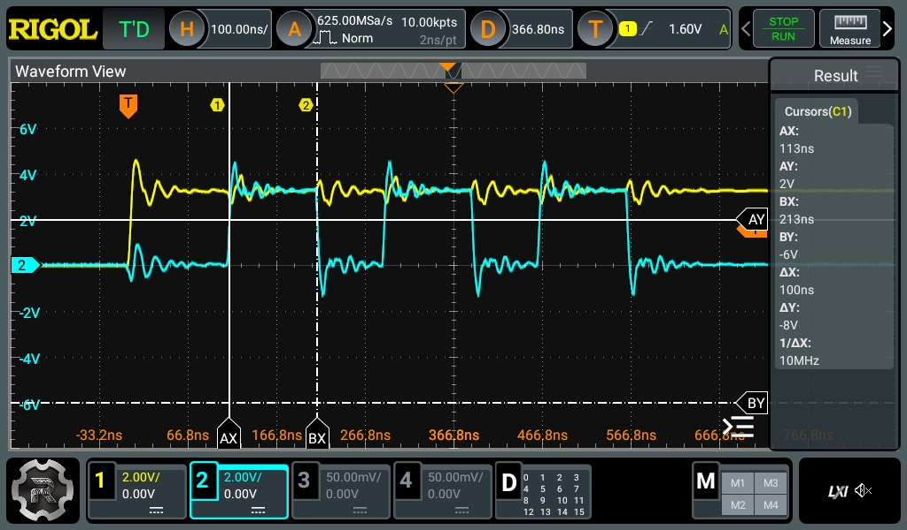
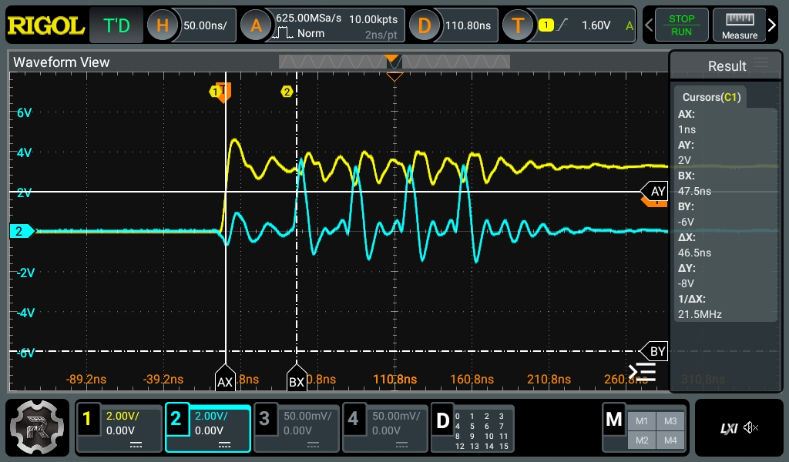

# PI Pico Pulse Generator
This tool is using a Raspberry Pi Pico as a configurable pulse generator. A rising edge on the trigger input will initiate a pulse of at a configurable offset to the trigger signal. The length of the pulse can be configured and optionally it can be repeated a specified number of times with a specified spacing.

The PIO blocks of the pico are used to achieve consistent timing. The output trigger duration can be configured over serial with a **resolution of 5 ns** (1 clock cycle of the Pi Pico at 200 MHz). Currently a 256 cycle (1280 ns) cooldown is implemented (hardcoded in pio) to prevent retriggering by the jitter from an EM glitch.

- offset:
  - min = 2 cycles (10 ns)
  - max = 4294967295 cycles (21.47 s)
  - **measured offset is always 1.6 ns larger that specified (meauring trigger and first rising edge at 2V threshhold)**
- length:
  - min = 1 cycle (5 ns)
  - max = 127 cycles (635 ns)
- spacing:
  - min = 6 cycles (30 ns)
  - max = 1048576 cycles (5.24 ms)
- repeats:
  - min = 0
  - max = 31

## Wiring
- trigger input -> GPIO_0
- pulse output  -> GPIO_1

## Build Instructions
```
export PICO_SDK_PATH=/opt/pico-sdk
mkdir build
cd build
cmake ..
make
```


## Usage
The output trigger duration can be controlled in clock cycles of the pi pico (8 ns each).
By default the output trigger duration is set to 10 clock cycles (= 80 ns).

The `delay_control.py` script can be used to set or get the parameters over serial.

**In bash commandline:**
```bash
python3 test.py --port /dev/ttyACM0 --get offset

python3 main.py --set offset=150
python3 main.py --set offset=150 length=300 repeats=10 spacing=10
```

**In python (see test_delay_control.py):**
```python
from delay_control import DelayController

try:
    with DelayController() as dc:
        # Set parameters
        dc.set_parameters({"offset": 5, "length": 3, "spacing": 10, "repeats": 2})

        # Get parameters
        offset = dc.get_parameter("offset")
        length = dc.get_parameter("length")
        spacing = dc.get_parameter("spacing")
        repeats = dc.get_parameter("repeats")

except serial.SerialException as e:
    print(f"Serial error: {e}")
except ValueError as e:
    print(f"Communication error: {e}")
```

## Example Measurements
<!-- In the following screenshots the trigger input and pulse output are both unloaded. In reality it is recommended to attach a small load (resistor) to minimize overshoots and undershoots -->

- offset: 15
- length: 20
- spacing: 15
- repeats: 2




- offset: 2
- length: 1
- spacing: 6
- repeats: 3



## Future Improvements
- Allow configuration of input and ouput as active low / active high
- Allow configuration of cooldown in `pulsegen.pio` (prevents retriggering due to jitter of )
